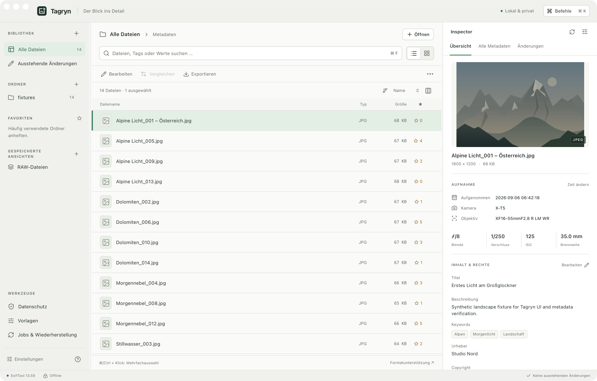

<p align="center"></p>

# Your files. Every detail.

An offline desktop workbench for inspecting, comparing, and deliberately editing file metadata. Built with Tauri, Rust, Vue, and ExifTool. Your files stay on your machine. No account, telemetry, or automatic map requests.

[Download & install](#download-and-install) · [Deutsch](README.de.md) · [Contribute](CONTRIBUTING.md) · [Roadmap](docs/ROADMAP.md) · [Discussions](https://github.com/franzgollhammer/tagryn/discussions) · [Releases](https://github.com/franzgollhammer/tagryn/releases)

[](https://github.com/franzgollhammer/tagryn/actions/workflows/verify.yml)
[](LICENSE)



_The native macOS app showing generated test images. The interface supports English and German._

## Desktop alpha

Tagryn 0.1.0 is early software with real file access, write plans, backups, and restoration. **Preview installers are available for macOS, Windows, and Linux.** macOS packages are ad-hoc signed, without Apple notarization; Windows installers are unsigned. See the [release](https://github.com/franzgollhammer/tagryn/releases/tag/v0.1.0-alpha.1) for verification details and known limits.

Start with disposable copies and keep independent backups. Tagryn does not promise complete anonymization. Original metadata can remain in backups, the local cache, job history, and exports. Read the [data-integrity limits](docs/SAFETY.md) before working with important files.

## Download and install

Download **Tagryn v0.1.0-alpha.1** directly from GitHub Releases. These are permanent release assets; no GitHub account or development tools are required. ExifTool and its runtime are included.

| System                                      | Download                                                                                                                                   | Install                                                                          |
| ------------------------------------------- | ------------------------------------------------------------------------------------------------------------------------------------------ | -------------------------------------------------------------------------------- |
| macOS 13.3+, Apple Silicon (M-series)       | [Apple Silicon DMG](https://github.com/franzgollhammer/tagryn/releases/download/v0.1.0-alpha.1/Tagryn_0.1.0-alpha.1_macos_arm64.dmg)       | Open the DMG and drag **Tagryn** onto **Applications**.                          |
| macOS 13.3+, Intel                          | [Intel app ZIP](https://github.com/franzgollhammer/tagryn/releases/download/v0.1.0-alpha.1/Tagryn_0.1.0-alpha.1_macos_x64.zip)             | Extract the ZIP and drag **Tagryn.app** into **Applications**.                   |
| Windows x64                                 | [Windows installer](https://github.com/franzgollhammer/tagryn/releases/download/v0.1.0-alpha.1/Tagryn_0.1.0-alpha.1_windows_x64-setup.exe) | Open the downloaded `.exe`, follow the installer, then launch Tagryn from Start. |
| Ubuntu / compatible Debian-based Linux, x64 | [Linux Debian package](https://github.com/franzgollhammer/tagryn/releases/download/v0.1.0-alpha.1/Tagryn_0.1.0-alpha.1_linux_amd64.deb)    | Install the downloaded `.deb` using the commands below.                          |

**macOS first launch:** If you used a DMG, eject it. Open Tagryn from Applications. Because this alpha is not notarized, macOS may block the first launch. If you trust this download, use **System Settings → Privacy & Security → Open Anyway** after trying to open it, then confirm. This is Apple's [per-app override](https://support.apple.com/en-us/102445); do not disable Gatekeeper globally. To choose the right download, check **Apple menu → About This Mac**: “Chip” means Apple Silicon, “Processor: Intel” means Intel.

**Windows first launch:** The installer has no verified publisher signature, so SmartScreen may warn. If you trust the download and Windows offers the option, choose **More info → Run anyway**. Keep system protections enabled; managed-device policies may prevent an override. Windows also needs the [WebView2 Runtime](https://developer.microsoft.com/en-us/microsoft-edge/webview2/); the installer can download it if missing.

**Linux:** In a terminal inside the folder containing your download:

```sh
sudo apt update
sudo apt install ./Tagryn_0.1.0-alpha.1_linux_amd64.deb
tagryn
```

You can also launch Tagryn from the application menu. The package was built and installation-tested on Ubuntu 22.04 x64. Other Debian-based distributions need compatible GTK/WebKitGTK libraries. Fedora, Arch, and ARM systems do not have release packages yet; see [Build from source](#build-from-source).

[SHA-256 checksums](https://github.com/franzgollhammer/tagryn/releases/download/v0.1.0-alpha.1/SHA256SUMS.txt) and [build provenance](https://github.com/franzgollhammer/tagryn/releases/download/v0.1.0-alpha.1/BUILD-INFO.json) accompany the installers. To compare a downloaded file with its checksum, run `shasum -a 256 FILE` on macOS, `sha256sum FILE` on Linux, or `Get-FileHash FILE -Algorithm SHA256` in PowerShell, replacing `FILE` with its path.

These are **alpha preview packages**. Native packaging checks cover installation/copying, bundled metadata processing, and startup on GitHub runners; they do not establish notarization, publisher reputation, or compatibility with every end-user system. GitHub also lists “Source code” archives below the installers; those are for building the app yourself.

## What you can do

- **Inspect:** open files or folders, scan recursively, browse a virtualized list or thumbnail grid, search loaded metadata, and inspect raw values with their exact tag identities.
- **Compare:** select up to eight files, see metadata differences, and use custom columns, favorites, and saved views.
- **Edit deliberately:** stage supported field edits, keywords, dates, GPS data, XMP sidecars, presets, metadata transfers, renaming, and CSV/JSON imports. Review the actual plan before saving.
- **Verify and restore:** create checked backups, reread saved values, inspect per-file job results, and restore only after conflict checks.
- **Work comfortably:** light/dark/system themes, adjustable text and panes, keyboard navigation, and a command palette.

Read support and write support differ by format. RAW edits use XMP sidecars; embedded audio/video/PDF writes, arbitrary technical tag editing, GPX matching, online maps, live filesystem watching, and automatic updates are not implemented. See the [format rules](docs/FORMATS.md).

## Build from source

Build on the operating system and CPU architecture where you will run Tagryn. Install Git, Node.js 24 LTS with npm, Rust through rustup, and the [Tauri system prerequisites](https://v2.tauri.app/start/prerequisites/). The repository pins Rust in `rust-toolchain.toml` and dependencies in the lockfiles.

| Platform    | Additional requirements                                                                                   |
| ----------- | --------------------------------------------------------------------------------------------------------- |
| macOS       | macOS 13.3 or newer; Xcode Command Line Tools. Apple Silicon and Intel have separate CI builds.           |
| Windows x64 | Visual Studio Build Tools with Desktop development with C++, plus WebView2.                               |
| Linux x64   | Compiler tools and GTK/WebKitGTK 4.1 development libraries. The workflow specifies Ubuntu 22.04 packages. |

On macOS, install the command-line tools with `xcode-select --install`. On Ubuntu 22.04, the build dependencies used by CI are:

```sh
sudo apt update
sudo apt install libwebkit2gtk-4.1-dev build-essential curl wget file libxdo-dev libssl-dev librsvg2-dev libayatana-appindicator3-dev patchelf
```

On Windows, select **Desktop development with C++** in Visual Studio Build Tools. Use an x64 MSVC Rust toolchain and a fresh PowerShell window after installing the prerequisites. On other Linux distributions, follow Tauri's distribution-specific prerequisites; the `.deb` command below applies only to Debian-based systems.

Download and prepare the released source with the following commands. They work in a macOS/Linux terminal or Windows PowerShell:

```sh
git clone --branch v0.1.0-alpha.1 --depth 1 https://github.com/franzgollhammer/tagryn.git
cd tagryn
npm ci
npm run runtime
npm run icons
npm run licenses
```

The first runtime build downloads checksum-pinned packages and compiles private Perl on macOS/Linux. It needs an internet connection and a C compiler. Later app launches and core workflows are offline; no existing ExifTool or Perl installation is required.

Choose your platform below to build an installable local package. Run its commands from the `tagryn` folder after completing the shared preparation above. Build output uses version `0.1.0`; the Git tag identifies it as an alpha.

### macOS

Use a native terminal and toolchain: Apple Silicon builds an ARM64 app, Intel builds an x64 app. There is no universal build.

```sh
npm run bundle -- --bundles app
mkdir -p artifacts
node scripts/verify-bundle.mjs --adhoc-sign
open src-tauri/target/release/bundle/macos
```

After verification succeeds, drag **Tagryn.app** from that Finder window into **Applications**, then open it. The script checks the nested runtime and applies a local ad-hoc signature. This is for use on the build machine; it is not an Apple Developer ID signature or notarization for distribution. Repeat the verification after rebuilding.

### Windows

In PowerShell:

```powershell
npm run bundle -- --bundles nsis
& ".\src-tauri\target\release\bundle\nsis\Tagryn_0.1.0_x64-setup.exe"
```

Follow the installer and launch **Tagryn** from the Start menu. The installer is unsigned. Windows ARM64 packages are not currently built.

### Linux

On Ubuntu or a compatible Debian-based x64 system:

```sh
npm run bundle -- --bundles deb
sudo apt install ./src-tauri/target/release/bundle/deb/Tagryn_0.1.0_amd64.deb
tagryn
```

For another distribution, after installing its Tauri prerequisites and completing the shared preparation, `npm run bundle -- --no-bundle` builds a local executable at `src-tauri/target/release/tagryn`. Run it from that build directory and keep the generated runtime/resources in place. This is a local build, not a system package, and has not received distribution-specific installation testing.

### Development and updates

Use `npm run desktop` to run the native app in development mode without installing it. `npm run dev` runs the frontend only. Native file access and saving require the desktop app. The browser review mode is read-only, uses generated fixtures, and is excluded from production builds. Use `TAGRYN_PROFILE_DIR` with an absolute path when you need an isolated development profile.

Tagryn has no automatic updater. To update, close the app and install a later package or build its release tag in a fresh checkout. The first save/restore walkthrough is in the [detailed German guide](README.de.md#erster-sicherer-arbeitsablauf).

## Build Tagryn with us

**AI-assisted contributions are welcome.** Use the tools you prefer to investigate bugs, write code, improve docs, and review changes. Understand what you submit, verify the behavior, and remain available for review. Small, clear pull requests make this work.

Start with [CONTRIBUTING.md](CONTRIBUTING.md). Agents should read [AGENTS.md](AGENTS.md). English documentation, synthetic format fixtures, accessibility checks, and focused bug fixes are useful first contributions. The complete test suite runs in GitHub Actions; local checks stay focused on the current change.

Franz Gollhammer maintains the project and its direction. Propose larger changes in an issue first. [Project principles](docs/PRINCIPLES.md) explain what belongs in Tagryn, and the [roadmap](docs/ROADMAP.md) lists priorities without promising delivery dates.

## Documentation

- [Architecture and runtime distribution](docs/ARCHITECTURE.md) — Rust service, metadata identity, cache, and bundling.
- [Formats and synchronization](docs/FORMATS.md) — what can be read and written.
- [Data integrity](docs/SAFETY.md) — write protocol, backup, restore, and known boundaries.
- [Historical local validation](docs/VALIDATION.md) — measurements and checks from the initial development build.
- [Release process](docs/RELEASING.md) and [private security reports](SECURITY.md).

The detailed technical documents are currently in German. English translations are welcome.

## License and credits

Tagryn's original code and documentation are released under the [MIT license](LICENSE). Third-party code and bundled runtimes retain their own licenses; see [third-party notices](docs/THIRD-PARTY-NOTICES.md) and [dependency license texts](docs/DEPENDENCY-LICENSES.txt).

ExifTool is by Phil Harvey. Tagryn also builds on Perl, Tauri, Vue, and the other components listed in its lockfiles. Omarchy's [doctrine](https://omarchy.org/doctrine/) inspired the approach to opinionated open source software and welcoming agents. Tagryn is independently maintained by [Franz Gollhammer](https://github.com/franzgollhammer).
