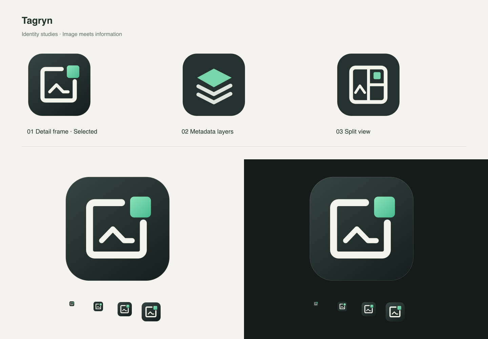

# Tagryn: Name und visuelle Identität

## Fünf Namen

| Vorschlag  | Begründung                                                                                                                   | Offensichtliche Kollisionen, geprüft am 10. September 2026                                                                                                                                                               |
| ---------- | ---------------------------------------------------------------------------------------------------------------------------- | ------------------------------------------------------------------------------------------------------------------------------------------------------------------------------------------------------------------------ |
| **Tagryn** | Kurzes Kunstwort aus „tag“ mit Anklang an „grain“. Präzise, international verwendbar und nicht auf ein Dateiformat begrenzt. | Keine offensichtliche gleichnamige Metadaten-App in der Websuche gefunden. Ein [Flickr-Nutzername](https://www.flickr.com/photos/tagryn/34012233040/) existiert. Favorit, aber Verfügbarkeit nicht abschließend geprüft. |
| Lumeta     | Licht und Metadaten in einem weichen, gut sprechbaren Namen.                                                                 | Bereits unter anderem für [KI-Software](https://www.lumeta.fun/) verwendet. Nicht ausgewählt.                                                                                                                            |
| Framio     | Bildrahmen, Dateiansicht und ein zugänglicher Klang.                                                                         | Direkte Kollision mit einer [Foto-/EXIF-Anwendung](https://framio.org/). Nicht ausgewählt.                                                                                                                               |
| Metra      | Präzision und messbare Dateiinformation.                                                                                     | Etablierter [Transportname mit digitalen Angeboten](https://metra.com/). Nicht ausgewählt.                                                                                                                               |
| Picta      | Unmittelbare fotografische Assoziation.                                                                                      | Bestehendes [Fotoprodukt](https://picta.com/app/). Nicht ausgewählt.                                                                                                                                                     |

Die Suche prüft nur offensichtliche Kollisionen. Markenregister, Domains, App-Store-Namen und die rechtliche Nutzbarkeit sind **ungeprüft**. Vor Veröffentlichung ist eine eigenständige Namensfreigabe nötig. Es wurden keine Domains gekauft und keine Markenanmeldungen vorgenommen.

## Drei visuelle Richtungen

1. **Detail Frame, ausgewählt:** Ein offener Bildrahmen und ein herausgelöstes jadefarbenes Detail verbinden Bildinhalt mit präziser Information. Die Form bleibt auch klein als eigenständige Silhouette erkennbar.
2. **Metadata Layers:** Drei versetzte Ebenen mit einer farbigen Deckfläche. Gut für Datenstrukturen, aber näher an allgemeinen Layer-Symbolen.
3. **Split View:** Ein kompakter geteilter Bild-/Inspector-Rahmen. Inhaltlich passend, bei 16 Pixeln jedoch dichter als Entwurf 1.

Die finale Form enthält keine Schrift, Kamera, Zahnrad oder austauschbares „i“. Ein dunkler Graphitkörper, ein warmes helles Rahmenelement und ein einzelnes Jade-Detail bestimmen die Identität. Die UI verwendet dieselbe Farbfamilie: `#267e60` für primäre Aktionen auf Hell, `#79d5a9` auf Dunkel, warme neutrale Hintergründe und Amber nur für ausstehende Änderungen.

## Editierbare Vorlagen und Exporte

- [Finales SVG, 1024er-Master](../assets/brand/tagryn.svg)
- [Optisch angepasster Kleinformat-Master](../assets/brand/tagryn-small.svg)
- [Editierbare Wortmarke](../assets/brand/wordmark.svg)
- [Entwurf 2](../assets/brand/study-b-layers.svg), [Entwurf 3](../assets/brand/study-c-detail.svg)
- [Editierbarer Hell-/Dunkel-Bogen](../assets/brand/specimen.svg)
- [ICNS](../src-tauri/icons/icon.icns), [ICO](../src-tauri/icons/icon.ico), [1024-PNG](../src-tauri/icons/1024x1024.png)
- Weitere transparente PNGs: 16, 24, 32, 48, 64, 128, 256 und 512 Pixel sowie `128x128@2x.png`.

Alle Formen wurden direkt als saubere Vektoren aufgebaut; es gibt keine generativ gerasterte Vorlage, die nur nachträglich in SVG eingebettet wurde. Die Wortmarke bleibt als Text editierbar und verwendet die jeweilige Systemschrift. Das Icon selbst hat keinerlei Schriftabhängigkeit.

Das große Icon besitzt einen transparenten Außenrand und einen zurückgesetzten, abgerundeten Körper. Kleine Größen verwenden vereinfachte, optisch angepasste Strichstärken. ICNS enthält die passenden Retina-Paare, ICO mehrere PNG-basierten Größen. `scripts/build-icons.mjs` erzeugt diese Dateien deterministisch aus den SVG-Mastern. Die Tauri-Konfiguration verweist direkt auf die fertigen Assets; es existiert kein Tauri-/Vite-/Vue-Standardicon im Produkt.

Die native Fensterbezeichnung, Menüleiste, Bundle-Bezeichnung, Bundle-ID `app.tagryn.desktop`, Dokumentation und Oberfläche verwenden konsistent Tagryn. Die tatsächliche Icon-Einbindung ist Teil der Bundle-Prüfung, nicht nur eine Designvorschau.
